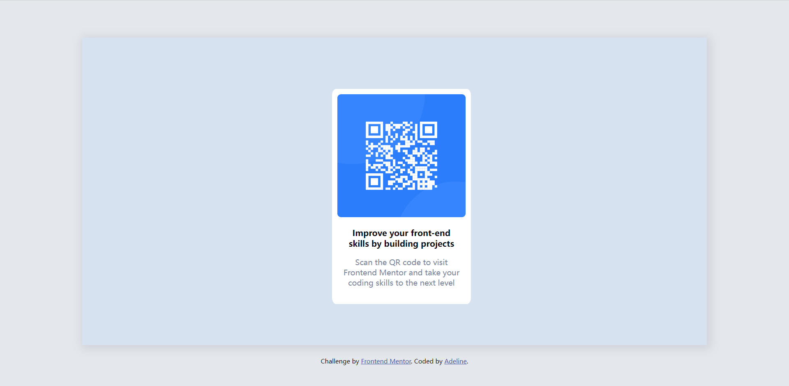

# Frontend Mentor - QR code component solution

This is a solution to the [QR code component challenge on Frontend Mentor](https://www.frontendmentor.io/challenges/qr-code-component-iux_sIO_H). Frontend Mentor challenges help you improve your coding skills by building realistic projects. 

## Table of contents

- [Frontend Mentor - QR code component solution](#frontend-mentor---qr-code-component-solution)
  - [Table of contents](#table-of-contents)
  - [Overview](#overview)
    - [Screenshot](#screenshot)
    - [Links](#links)
  - [My process](#my-process)
    - [Built with](#built-with)
    - [What I learned](#what-i-learned)
    - [Continued development](#continued-development)
    - [Useful resources](#useful-resources)
  - [Author](#author)
  - [Acknowledgments](#acknowledgments)

## Overview

### Screenshot

### Links

- Solution URL: [Add solution URL here](https://your-solution-url.com)
- Live Site URL: [Add live site URL here](https://your-live-site-url.com)

## My process

### Built with

- Semantic HTML5 markup
- CSS custom properties

### What I learned

> Margin collapsing occurs in three basic cases:
> 1. **Adjacent siblings**
The margins of adjacent siblings are collapsed (except when the latter sibling needs to be cleared past floats).
> 2. **No content separating parent and descendants**
If there is no border, padding, inline part, block formatting context created, or clearance to separate the margin-top of a block from the margin-top of one or more of its descendant blocks; or no border, padding, inline content, height, or min-height to separate the margin-bottom of a block from the margin-bottom of one or more of its descendant blocks, then those margins collapse. The collapsed margin ends up outside the parent.
>
> 3. **Empty blocks**
If there is no border, padding, inline content, height, or min-height to separate a block's margin-top from its margin-bottom, then its top and bottom margins collapse.

### Continued development

+ A deeper understanding of box model
+ Responsive layout

### Useful resources

- [Free Code Camp](https://www.freecodecamp.org) - I'm learning frontend from this website. So helpful it is!
- [MDN DOC](https://developer.mozilla.org) - Get back to the manual whenever you are stuck.

## Author

- Website - [There will be one]

## Acknowledgments

Thank you, my eyes, for suffering from staring at screen.
Thank you, my brain, for learning new knowledge and solving problems.
Thank you, my body, for keeping healthy all the time.
